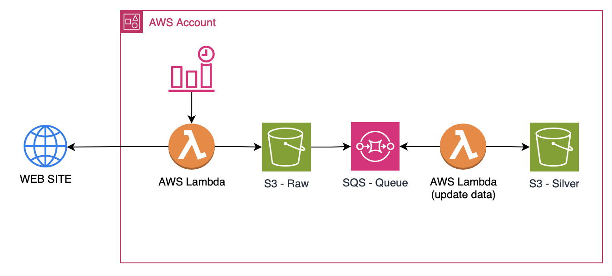

# eSportsForge
`eSportsForge` is a data engineering project focused on building a Data Lake for eSports data. This repository encompasses the collection, transformation, and exposure of professional eSports match data. The main components include:

* Data Ingestion: Pipelines for extracting data on matches, teams, and players.
* Data Transformation: Processing steps aimed at structuring data for easy and efficient consumption, including cleaning, aggregation, and enrichment.
* Data API Access: Exposing the transformed data through an API to facilitate access and integration.

The goal of eSportsForge is to create a robust data infrastructure that enables in-depth analysis and application development, providing valuable insights for the eSports community.

## Explanation
At current moment, valorant do not has an easy way to  consume pro matches data. The whole idea of this project is to consume data with web scraping and consolidate that data.

## Data Freshness

This section is to show you the schedule and routines of Lambda Functions.

| LambdaFunction | Event Status | CRON |
| - | - | - |
| `FunctionValorantProMatch` | **ENABLE** | `0 12,23 * * ? *`

[AWS Cron Expression](https://docs.aws.amazon.com/systems-manager/latest/userguide/reference-cron-and-rate-expressions.html#reference-cron-and-rate-expressions-intro)

## Architecture
